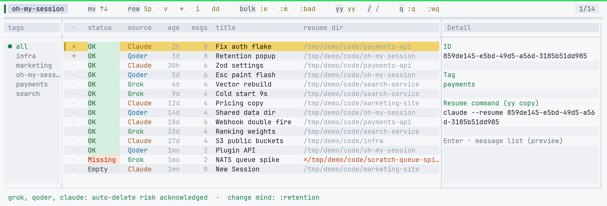
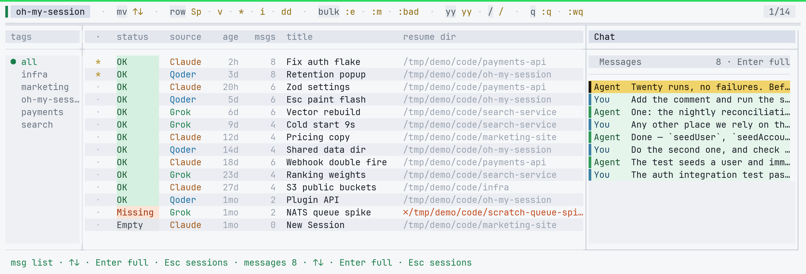
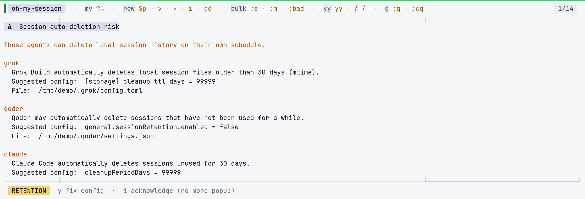

# oh-my-session

**Stop scrolling a long conversation list from `/resume` to find last week's half-finished one.**

Stop guessing whether that was Qoder, Grok, or Claude Code — and stop hunting which directory you were in.

**One tool. All sessions. Sorted.** Copy the resume command with `yy`. Keys feel like Vim.

[](https://www.npmjs.com/package/oh-my-session)
[](./LICENSE)
[](https://nodejs.org/)

**English** · [中文速览](./docs/README_zh-CN.md)

```bash
npm install -g oh-my-session
oms
```

Agents also **auto-delete** old sessions (Claude ~30 days by default). `:retention` shows the config and can fix it for you.

---

## Demo

Main UI (tags · sessions · detail):



Chat view after **Enter** (near→far; **Esc** back to sessions):



`:retention` — what each agent is about to delete, and the config that stops it:



---

## Why?

You use more than one coding agent. Each dumps sessions into a different home directory with different resume rules. After a week you have dozens of half-finished threads and no idea:

| Question | Without this tool | With **oh-my-session** |
|----------|-------------------|-------------------------|
| What sessions do I still have? | Dig through `~/.grok`, `~/.qoder`, `~/.claude` | One sorted table |
| Can I resume this? | Trial and error | **OK / Empty / Missing** badges |
| Where do I `cd`? | Guess the project path | **RESUME DIR** column + copy command |
| What did we talk about? | Open raw JSONL | **Enter** → chat pane (near→far) |
| How do I organize? | Nowhere | Tags, stars, renames (local CSV) |

---

## Features

- **Multi-agent discovery** — Grok Build, Qoder, Claude Code (Codex / Cursor reserved)
- **Health at a glance** — `OK` · `Empty` · `Missing` (path gone but still shown)
- **Resume-ready** — `yy` copies the exact command to your clipboard (macOS works out of the box via `pbcopy`; Qoder includes `cd …`)
- **Chat preview** — Enter opens a **view-only** transcript, newest first; Esc back to the list
- **Vim-ish TUI** — ↑↓ · gg/G · `/` search · Space multi-select · `dd` + `:wq` delete
- **English / 简体中文** — first launch picks a language; change anytime with `:lang`
- **`:feedback`** — opens the GitHub repo in your browser
- **Organize locally** — rename (`i`), star (`*`), tag (`t`) — **never rewrites agent stores**
- **Retention check** — warns when an agent is set to auto-delete old sessions; `:retention` applies the config for you (asks first, keeps a `.bak`)
- **Private by default** — titles / stars / tags live in gitignored CSV under `data/`
- **Auto refresh** — re-scans disk every 8s while idle
- **Scriptable** — `--list` / `--json` for pipes and automation

---

## Quick start

### Prerequisites

- **Node.js ≥ 18**
- A terminal with truecolor recommended (VS Code, Windows Terminal, iTerm2, …)

### Install & run

```bash
npm install -g oh-my-session
oms
```

Or run without installing globally:

```bash
npx oh-my-session
```

### From source

```bash
git clone https://github.com/cool-ic/oh-my-session.git
cd oh-my-session
npm install
npm start
```

### Non-interactive

```bash
oms --list                 # plain table on stdout
oms --json                 # JSON array
oms --source grok,claude
oms --help
```

---

## Supported agents

| Source | Store (read-only) | Resume command |
|--------|-------------------|----------------|
| **Grok Build** | `$GROK_HOME/sessions/…` · `updates.jsonl` | `grok --resume <id>` (any cwd) |
| **Qoder** | Qoder project / history jsonl | `cd <project> && qodercli -r <id>` |
| **Claude Code** | `~/.claude/projects/<slug>/*.jsonl` | `claude --resume <id>` (any cwd) |
| Codex / Cursor | Reserved in types | — |

---

## UI overview

Wide terminals (≥ ~120 cols): **tags | session table | detail/chat**.

| Pane | Role |
|------|------|
| **Left · tags** | Filter by tag (`all` = everything). `t` assigns a tag |
| **Center · sessions** | Main list — select, multi-select, mark delete |
| **Right · detail / chat** | Meta (id, tag, resume cmd) or **Chat** after Enter |

### Status badges

| Badge | Meaning |
|-------|---------|
| **OK** | Has messages; resume path exists on disk |
| **Empty** | Zero messages (scratch / abandoned) |
| **Missing** | Resume path or store path gone — string still shown with `✗` |

---

## Keyboard cheatsheet

| Key | Action |
|-----|--------|
| `↑` `↓` | Move |
| `gg` / `G` | Top / bottom |
| **`Enter`** | Open **chat** (near→far, view only) |
| **`Esc`** | Close chat → session list · or clear multi-select |
| `Tab` | Tags rail ↔ sessions (from chat: leave chat → sessions) |
| `t` | Assign / create tag for current session |
| `Space` | Toggle multi-select |
| `*` | Star / unstar — pin top; **blocks `dd`** until unstarred |
| `i` | Rename title (saved to local CSV) |
| `/` | Search title / id / path |
| `yy` | Copy **resume command** to clipboard; never runs it |
| `dd` | Mark delete (selection or cursor; skipped if starred) |
| `u` | Undo last delete mark |
| `:empty` `:missing` `:bad` | Bulk-select by health |
| `:wq` | **Apply** deletes and quit |
| `:q` / `:q!` | Quit if clean · force quit discard marks |
| `:retention` | Stop agents auto-deleting old sessions (shows the change, asks first) |
| `:lang` | Change UI language (`en` / `zh`; first launch asks once) |
| `:feedback` | Open the GitHub repo in your browser |
| `:help` | Full shortcut overlay |

Bare `q` and `Ctrl-C` **do not** quit (avoids losing pending deletes).

Full spec: [`d/ui-tui.md`](./d/ui-tui.md) · in-app `:help`.

---

## Local settings (CSV)

Preferences are **local only** — they never patch Grok / Qoder / Claude stores.

| Feature | File | Notes |
|---------|------|--------|
| Rename (`i`) | `data/session-titles.csv` | `source,id,title,updated_at` |
| Star (`*`) | `data/session-stars.csv` | Pin + protect from `dd` |
| Tag (`t`) | `data/session-tags.csv` | One tag per session |
| Language | `data/ui-locale` | `en` or `zh` (first-run prompt) |

These paths are **gitignored**. Safe to back up privately; not published with the repo.

Runtime-only (not persisted): search filters, multi-select, scroll, open chat.

---

## How it works

```
 disk stores (read-only)
        │
        ▼
  discover/{grok,qoder,claude}
        │  SessionRecord[]
        ▼
  health · title CSV · star CSV · tag CSV
        │
        ├─► TUI (raw differential paint, CJK-aware width)
        └─► --list / --json
```

- **No network** for discovery — everything is local filesystem.
- **Delete** only happens on `:wq` after explicit `dd` marks.
- **Agent settings** are only written by `:retention`, after you confirm — it keeps
  every other key, and copies the old file to `settings.json.bak`.
- **Chat** reads jsonl / updates streams; shows user + assistant only (no tools/thoughts).

Architecture map: [`d/codemap.md`](./d/codemap.md).

---

## Project layout

```
oh-my-session/
├── src/
│   ├── index.ts           # CLI entry
│   ├── discover/          # Grok / Qoder / Claude scanners
│   ├── lib/               # health, resume, CSV stores, transcript, width
│   └── tui/               # rawApp + theme
├── data/                  # local CSV (gitignored)
├── docs/
│   ├── README_zh-CN.md    # Chinese README
│   └── images/            # TUI screenshots
├── scripts/
│   ├── screenshot.sh      # tmux → PNG
│   └── ansi_to_png.py
├── d/                     # design / store / UI specs
├── package.json
└── README.md
```

---

## Configuration

| Variable | Effect |
|----------|--------|
| `AGENT_SESSION_SOURCES` | Comma list, e.g. `grok,claude` (default: `grok,qoder,claude`) |
| `GROK_HOME` | Grok data root (if set by the Grok tooling) |
| `QODER_CONFIG_DIR` | Qoder config root override (defaults to `~/.qoder`) |
| `CLAUDE_CONFIG_DIR` | Claude config root override |
| `OMS_DATA_DIR` | Where the local title / star / tag CSVs live (default `<repo>/data`) |

---

## Roadmap

- [ ] Codex / Cursor discovery when layouts stabilize
- [ ] Export selected sessions metadata
- [ ] Theme presets

Issues and PRs welcome: [github.com/cool-ic/oh-my-session](https://github.com/cool-ic/oh-my-session).

---

## Docs (for contributors / agents)

| Doc | Role |
|-----|------|
| [docs/README_zh-CN.md](./docs/README_zh-CN.md) | Full Chinese README |
| [d/ui-tui.md](./d/ui-tui.md) | TUI layout & keys |
| [d/session-stores.md](./d/session-stores.md) | On-disk formats & resume semantics |
| [d/constraints.md](./d/constraints.md) | Hard boundaries |
| [d/codemap.md](./d/codemap.md) | Module map |
| [workflow.md](./workflow.md) | Process notes |

---

## License

[MIT](./LICENSE) © cool-ic

---

---

**Stop hunting through `~/.agent` folders.**

```bash
npm install -g oh-my-session && oms
```
