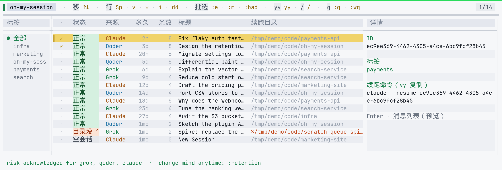
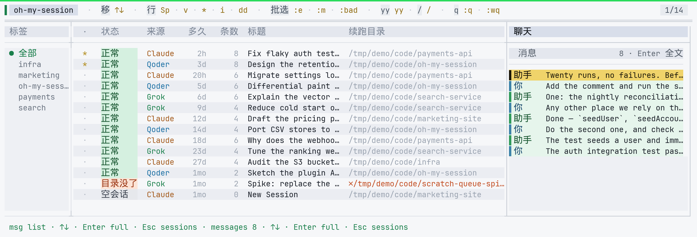
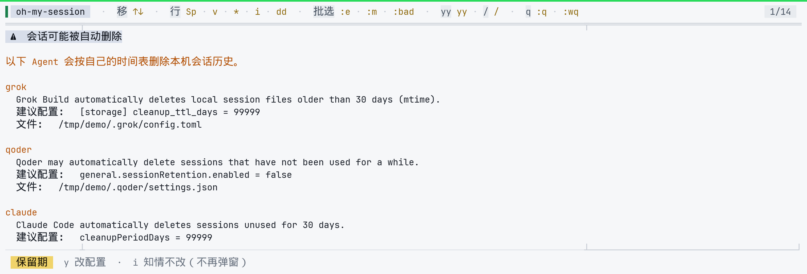

# oh-my-session

**别再翻 `~/.claude` / `~/.grok` 找半截对话了。**

一张表管住 Grok · Qoder · Claude 的本地会话：能不能续跑、去哪个目录、`yy` 复制命令、Enter 回看聊天。

[](https://www.npmjs.com/package/oh-my-session)
[](../LICENSE)
[](https://nodejs.org/)

[English](../README.md) · **简体中文**

```bash
npm install -g oh-my-session
oms
```

Agent 默认会**自动删旧会话**（Claude 约 30 天）。`:retention` 一键看清配置并帮你改掉。

---

## 演示

主界面（标签栏 · 会话表 · 详情）：



打开聊天（Enter · 近→远 · Esc 回列表）：



`:retention` —— 各 Agent 正准备删掉什么，以及能阻止它的配置：



---

## 为什么需要？

你往往不只用一个编程 Agent。它们各自把会话丢在不同目录，续跑规则也不同。一周后你会面临：

| 问题 | 没有本工具 | 用 **oh-my-session** |
|------|------------|------------------------|
| 还有哪些会话？ | 翻 `~/.grok`、`~/.qoder`、`~/.claude` | 一张按活跃时间排序的表 |
| 还能不能续跑？ | 试了才知道 | **正常 / 空会话 / 目录没了** |
| 该 `cd` 到哪？ | 猜项目路径 | **续跑目录** + `yy` 复制命令 |
| 当初聊了啥？ | 硬读 JSONL | **Enter** → 右侧聊天（近→远） |
| 怎么整理？ | 没有 | 标签 / 置顶 / 重命名（本地 CSV） |

---

## 功能特性

- **多 Agent 发现** — Grok Build、Qoder、Claude Code（Codex / Cursor 预留）
- **健康一览** — `正常` · `空会话` · `目录没了`（路径没了也会保留字符串）
- **续跑就绪** — `yy` 把完整命令复制到剪贴板（macOS 通过系统自带 `pbcopy` 开箱即用；Qoder 会带 `cd …`）
- **对话预览** — Enter 打开**只读** transcript，最新在上；Esc 回中间列表
- **Vim 风格 TUI** — ↑↓ · gg/G · `/` 搜索 · Space 选中 · `v` 可视选择 · `dd` + `:wq` 删除
- **中英双语** — 首次启动选择语言；之后可用 `:lang` 切换
- **`:feedback`** — 浏览器打开本仓库 GitHub（反馈 / Issue）
- **本地整理** — 重命名（`i`）、置顶（`*`）、分配标签（`t`）— **绝不改写**各 Agent 原生存储
- **保留期检查** — 发现 Agent 正在自动删除旧会话时给出提示；`:retention` 确认后一键改配（并留 `.bak`）
- **默认隐私** — 标题 / 星标 / 标签写在 gitignore 的 `data/*.csv`
- **自动刷新** — 空闲时每 8 秒重扫磁盘
- **可脚本化** — `--list` / `--json` 便于管道与自动化

---

## 快速开始

### 环境要求

- **Node.js ≥ 18**
- 建议真彩终端（VS Code、Windows Terminal、iTerm2 等）

### 安装并运行

```bash
npm install -g oh-my-session
oms
```

也可以不全局安装，直接试用：

```bash
npx oh-my-session
```

### 从源码运行

```bash
git clone https://github.com/cool-ic/oh-my-session.git
cd oh-my-session
npm install
npm start
```

### 非交互模式

```bash
oms --list                 # 纯文本表
oms --json                 # JSON 数组
oms --source grok,claude
oms --help
```

---

## 支持的 Agent

| 来源 | 存储（只读） | 续跑命令 |
|------|--------------|----------|
| **Grok Build** | `$GROK_HOME/sessions/…` · `updates.jsonl` | `grok --resume <id>`（任意目录） |
| **Qoder** | Qoder 项目 / history jsonl | `cd <项目> && qodercli -r <id>` |
| **Claude Code** | `~/.claude/projects/<slug>/*.jsonl` | `claude --resume <id>`（任意目录） |
| Codex / Cursor | 类型中预留 | — |

---

## 界面说明

宽屏（约 ≥ 120 列）：**标签栏 | 会话表 | 详情/聊天**。

| 区域 | 作用 |
|------|------|
| **左 · tags** | 按标签过滤（`all` = 全部）。`t` 给当前会话分配标签 |
| **中 · sessions** | 主列表 — 选择、片选、标记删除 |
| **右 · detail / chat** | 元信息（id、标签、resume 命令）或 Enter 后的 **Chat** |

### 状态徽章

| 徽章 | 含义 |
|------|------|
| **OK** | 有消息；续跑路径存在 |
| **Empty** | 0 条消息（草稿 / 废弃） |
| **Missing** | 续跑路径或存储路径已不存在 — 仍显示原文，带 `✗` |

---

## 快捷键速查

| 键 | 作用 |
|----|------|
| `↑` `↓` | 移动 |
| `gg` / `G` | 首 / 末 |
| **`Enter`** | 打开 **聊天**（近→远，只读） |
| **`Esc`** | 关闭聊天 → 中间会话列表 · 或清空片选 |
| `Tab` | 标签栏 ↔ 会话表（聊天中：离开聊天 → 会话） |
| `t` | 为当前会话分配 / 新建标签 |
| `Space` | 切换片选 |
| `*` | 星标 / 取消 — 置顶；**未取消前禁止 `dd`** |
| `i` | 重命名标题（写入本地 CSV） |
| `/` | 搜索标题 / id / 路径 |
| `yy` | 复制 **resume 命令** 到剪贴板；从不执行 |
| `dd` | 标记删除（片选或当前行；星标会话跳过） |
| `u` | 撤销最近一次删除标记 |
| `:empty` `:missing` `:bad` | 按健康状态批量片选 |
| `:wq` | **应用**删除并退出 |
| `:q` / `:q!` | 无待删时退出 · 丢弃标记强制退出 |
| `:retention` | 阻止 Agent 自动删除旧会话（展示改动，确认后生效） |
| `:lang` | 切换界面语言（`en` / `zh`；首次启动会询问一次） |
| `:feedback` | 用浏览器打开本仓库 GitHub（反馈 / Issue） |
| `:help` | 完整快捷键浮层 |

裸 `q` 与 `Ctrl-C` **不会**退出（防止误丢待删标记）。

完整规格：[`d/ui-tui.md`](../d/ui-tui.md) · 应用内 `:help`。

---

## 本地设置（CSV）

偏好**仅存本地** — 不会回写 Grok / Qoder / Claude 的原生库。

| 功能 | 文件 | 说明 |
|------|------|------|
| 重命名（`i`） | `data/session-titles.csv` | `source,id,title,updated_at` |
| 星标（`*`） | `data/session-stars.csv` | 置顶 + 保护不被 `dd` |
| 标签（`t`） | `data/session-tags.csv` | 一会话一个标签 |
| 界面语言 | `data/ui-locale` | `en` 或 `zh`（首次启动询问） |

这些路径在 **.gitignore** 中。可自行私密备份，不会随仓库公开。

仅运行时内存（不落盘）：搜索筛选、片选、滚动、是否打开聊天。

---

## 工作原理

```
 磁盘会话存储（只读）
        │
        ▼
  discover/{grok,qoder,claude}
        │  SessionRecord[]
        ▼
  health · 标题 CSV · 星标 CSV · 标签 CSV
        │
        ├─► TUI（差分绘制，CJK 显示宽）
        └─► --list / --json
```

- 发现过程**不访问网络** — 只读本地文件系统。
- **删除**仅在 `:wq` 且经过明确 `dd` 标记后执行。
- **Agent 配置**只有 `:retention` 在你确认之后才会写入：保留其余所有键，并把原文件
  备份为 `settings.json.bak`。
- **聊天**读 jsonl / updates；只显示 user + assistant（不含 tool / thought）。

架构图：[`d/codemap.md`](../d/codemap.md)。

---

## 配置

| 变量 | 作用 |
|------|------|
| `AGENT_SESSION_SOURCES` | 逗号分隔，如 `grok,claude`（默认 `grok,qoder,claude`） |
| `GROK_HOME` | Grok 数据根目录 |
| `QODER_CONFIG_DIR` | Qoder 配置目录覆盖（默认 `~/.qoder`） |
| `CLAUDE_CONFIG_DIR` | Claude 配置目录覆盖 |
| `OMS_DATA_DIR` | 标题 / 星标 / 标签 CSV 的存放目录（默认 `<repo>/data`） |

---

## 路线图

- [ ] Codex / Cursor 发现（布局稳定后）
- [ ] 可选：把 resume 命令写入系统剪贴板
- [ ] 导出所选会话元数据
- [ ] 主题预设

欢迎提 Issue / PR： [github.com/cool-ic/oh-my-session](https://github.com/cool-ic/oh-my-session)。

---

## 文档（贡献者 / Agent）

| 文档 | 用途 |
|------|------|
| [d/ui-tui.md](../d/ui-tui.md) | TUI 布局与快捷键 |
| [d/session-stores.md](../d/session-stores.md) | 落盘格式与 resume 语义 |
| [d/constraints.md](../d/constraints.md) | 硬边界 |
| [d/codemap.md](../d/codemap.md) | 模块地图 |
| [workflow.md](../workflow.md) | 过程说明 |

---

## 许可证

[MIT](../LICENSE) © cool-ic

---

---

**别再翻 `~/.agent` 目录了。**

```bash
npm install -g oh-my-session && oms
```
